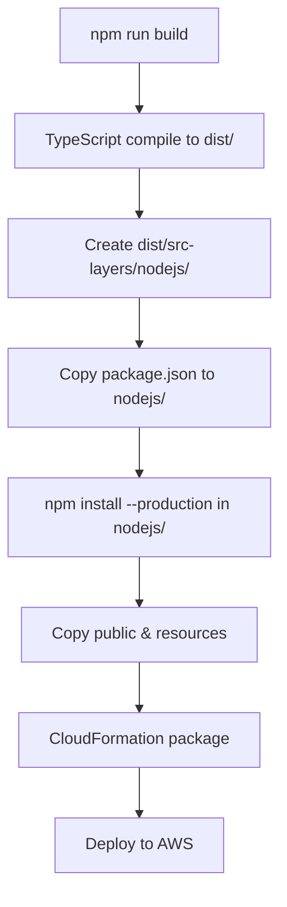

# Deploy Troubleshooting - Lambda Layer Dependencies

## Vấn đề: Cannot find module 'mysql2/promise'

### Nguyên nhân:
Lambda Layer không có `mysql2` package khi deploy lên AWS.

### Giải pháp đã áp dụng:

#### 1. Cập nhật `buildspec.yml`

**Thêm các bước sau vào build process:**

```yaml
# Copy package files to nodejs directory (Lambda Layer structure)
- cp src-layers/package.json dist/src-layers/nodejs/
- cp src-layers/package-lock.json dist/src-layers/nodejs/

# Install production dependencies for Lambda Layer
- cd dist/src-layers/nodejs && npm install --production && cd ../../../

# Copy public and resources folders
- cp -r src-layers/public/* dist/src-layers/public/
- cp -r src-layers/resources/* dist/src-layers/resources/
```

### Cấu trúc Lambda Layer đúng:

```
dist/src-layers/
├── nodejs/                    # ← Lambda Layer expects this folder
│   ├── node_modules/         # ← Dependencies here
│   │   ├── mysql2/           # ← mysql2 package
│   │   ├── @aws-sdk/
│   │   └── ...
│   ├── package.json
│   └── package-lock.json
├── public/                    # ← Public assets
│   └── ...
├── resources/                 # ← Email templates
│   └── ...
├── constants/                 # ← Compiled TS files
├── database/
├── services/
└── ...
```

### Verify trước khi deploy:

**Local check:**
```bash
# Build
npm run build

# Check if mysql2 exists in layer
ls -la dist/src-layers/nodejs/node_modules/ | grep mysql2
```

**Expected output:**
```
drwxr-xr-x  mysql2
```

### Template.yml - Layer Configuration

Đảm bảo Layer được định nghĩa đúng:

```yaml
SrcLayer:
  Type: AWS::Serverless::LayerVersion
  Properties:
    LayerName: !Sub ${ProjectId}-${Stage}-src-layers
    Description: Layer with MySQL and other dependencies
    ContentUri: dist/src-layers/
    CompatibleRuntimes:
      - nodejs22.x
    LicenseInfo: "MIT"
    RetentionPolicy: Retain
```

### Lambda Function - Sử dụng Layer

```yaml
Globals:
  Function:
    Runtime: nodejs22.x
    Layers:
      - !Ref SrcLayer  # ← Must reference the layer
```

## Checklist để tránh lỗi:

- [ ] `buildspec.yml` đã copy package.json vào `dist/src-layers/nodejs/`
- [ ] `buildspec.yml` đã chạy `npm install --production` trong `dist/src-layers/nodejs/`
- [ ] `template.yml` có định nghĩa `SrcLayer` với `ContentUri: dist/src-layers/`
- [ ] Lambda functions có `Layers: - !Ref SrcLayer` trong config
- [ ] `src-layers/package.json` có `mysql2` trong dependencies

## Kiểm tra sau khi deploy:

### 1. Check CloudFormation Stack
```bash
aws cloudformation describe-stacks \
  --stack-name BP-api-serverless-dev-lambda-stack \
  --query 'Stacks[0].StackStatus'
```

### 2. Check Lambda Layer Version
```bash
aws lambda list-layer-versions \
  --layer-name BP-api-serverless-dev-src-layers \
  --query 'LayerVersions[0].LayerVersionArn'
```

### 3. Test Lambda Function
```bash
aws lambda invoke \
  --function-name BP-api-serverless-dev-api-get-greetings \
  --payload '{}' \
  response.json

cat response.json
```

### 4. Check CloudWatch Logs
```bash
aws logs tail /aws/lambda/BP-api-serverless-dev-api-get-greetings --follow
```

## Common Issues:

### Issue 1: Module not found
**Symptom:** `Cannot find module 'mysql2/promise'`

**Solution:**
```bash
# Verify package.json has mysql2
cat src-layers/package.json | grep mysql2

# Should see:
"mysql2": "^3.11.5"
```

### Issue 2: Wrong Layer Structure
**Symptom:** Lambda can't find any modules

**Solution:**
```bash
# Layer must have nodejs/ folder
dist/src-layers/
└── nodejs/          ← MUST have this
    └── node_modules/
```

### Issue 3: Dependencies not installed
**Symptom:** `Cannot find module` for any package

**Solution:**
```bash
# In buildspec.yml, ensure:
cd dist/src-layers/nodejs && npm install --production
```

## Build Process Flow:



## Deployment Commands:

### Manual Deploy (for testing)
```bash
# 1. Build
npm run build

# 2. Install layer dependencies
cd dist/src-layers/nodejs
npm install --production
cd ../../../

# 3. Package
aws cloudformation package \
  --template-file template.yml \
  --s3-bucket YOUR-BUCKET-NAME \
  --output-template-file packaged-template.yml

# 4. Deploy
aws cloudformation deploy \
  --template-file packaged-template.yml \
  --stack-name BP-api-serverless-dev-lambda-stack \
  --parameter-overrides Stage=dev \
  --capabilities CAPABILITY_IAM CAPABILITY_NAMED_IAM
```

### Via CodePipeline
```bash
# Just push to branch
git add .
git commit -m "Fix: Add mysql2 to Lambda Layer"
git push origin develop

# CodePipeline will:
# 1. Trigger on commit
# 2. Run buildspec.yml
# 3. Install dependencies
# 4. Package & Deploy
```

## Environment-specific Notes:

### Local (SAM)
```bash
# Local uses docker network
# Dependencies in dist/src-layers/nodejs/node_modules/
```

### AWS Lambda
```bash
# Lambda uses /opt/nodejs/node_modules/
# Layer extracts to /opt/
```

### Path Resolution
```typescript
// In code, use /opt/ prefix
import { MySQLConnection } from '/opt/database/db/mysql-connection';
import { LoggerService } from '/opt/services';

// Lambda resolves to:
// /opt/database/db/mysql-connection.js
// /opt/services/index.js
```

## Success Indicators:

✅ Build completes without errors
✅ `dist/src-layers/nodejs/node_modules/mysql2/` exists
✅ CloudFormation stack status: `CREATE_COMPLETE` or `UPDATE_COMPLETE`
✅ Lambda function test returns 200
✅ CloudWatch logs show no "Cannot find module" errors

## Debug Tips:

### 1. List files in Lambda Layer (after deploy)
```bash
# Create test function that lists files
aws lambda invoke \
  --function-name YOUR-FUNCTION \
  --payload '{"action":"list-files"}' \
  response.json
```

### 2. Check Layer contents
```bash
# Download layer
aws lambda get-layer-version \
  --layer-name BP-api-serverless-dev-src-layers \
  --version-number 1 \
  --query 'Content.Location' \
  --output text | xargs wget -O layer.zip

# Extract and check
unzip layer.zip
ls -la nodejs/node_modules/ | grep mysql2
```

### 3. Verify in console
1. Go to AWS Lambda Console
2. Select your function
3. Click "Layers" section
4. Verify layer is attached
5. Check layer version

---

**Remember:** Lambda Layer expects dependencies in `nodejs/node_modules/` folder!

**Created:** October 7, 2025  
**Project:** BP-api-serverless

